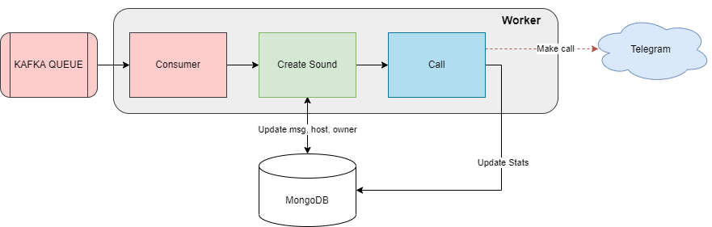

- [Atuo-calling-worker](#atuo-calling-worker)
  - [Feature overview](#feature-overview)
  - [Building](#building)
  - [Running](#running)
  - [Event Call](#event-call)
  - [Format message queue kafka](#format-message-queue-kafka)
  - [How to start](#how-to-start)

# Atuo-calling-worker

## Feature overview

- Worker receive message from Kafka queue and make call via Telegram



## Building

- Building the Docker image

```
docker build .
```

## Running

Update ENV ```docker-compose.yml```

```
docker-compose up -d mongo
python3 create_session.py
python3 create_account.py
docker-compose up -d
```

## Event Call

- Filter msg, owner, host, state from kafka message
- Create local sound from receive message
- Mapping owner and id telegram in collection social_account from MongoDB
- Select session from MongoDB
- Make call to telegram and update status to MongoDB

## Format message queue kafka

```json
{
    "_id": "60a3f9449501d60008813aaa",
    "host": "192.168.199.199",
    "owner": "Admin",
    "service": "Nginx",
    "state": "CRITICAL",
    "status": "FIRING",
    "msg": "Port 8080 down",
    "action": "PENDING",
    "created": "2021-12-12T12:12:12.409Z",
    "makecall":"true"
}
```

## How to start

- Install Pyrogram
  - The easiest way to install and upgrade Pyrogram to its latest stable version is by using pip:
    ```$ pip3 install -U pyrogram```
  - Get your own Telegram API key from <https://my.telegram.org/apps>
    - Save ```api_id```, ```api_hash``` to collection ```session``` in MongoDB
    - Update data to collection ```social_account``` in MongoDB
  - Get Telegram session manual:
    - Step 1: Update ```api_id```, ```api_hash```, ```phone_number``` to ```create_session.py```
    - Step 2: Update ```owner_id```, ```full_name```, ```telegram_id``` to ```create_session.py```
    - Step 3: Run ```python3 create_session.py```
    - Step 4: Run ```python3 create_account.py```
    - Step 5: Enter phone number
    - Step 6: Enter OTP
    - Step 7: Update the session string to collection ```session``` in MongoDB
  - Up docker-compose after MongoDB, Kafka, auto-calling-gateway up
